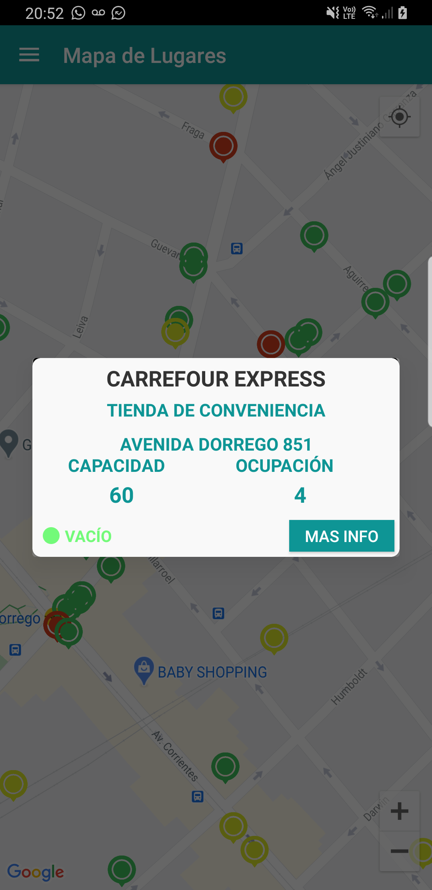
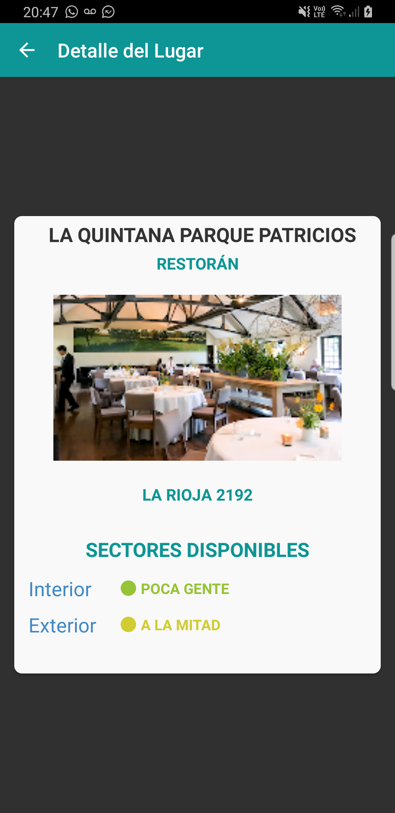
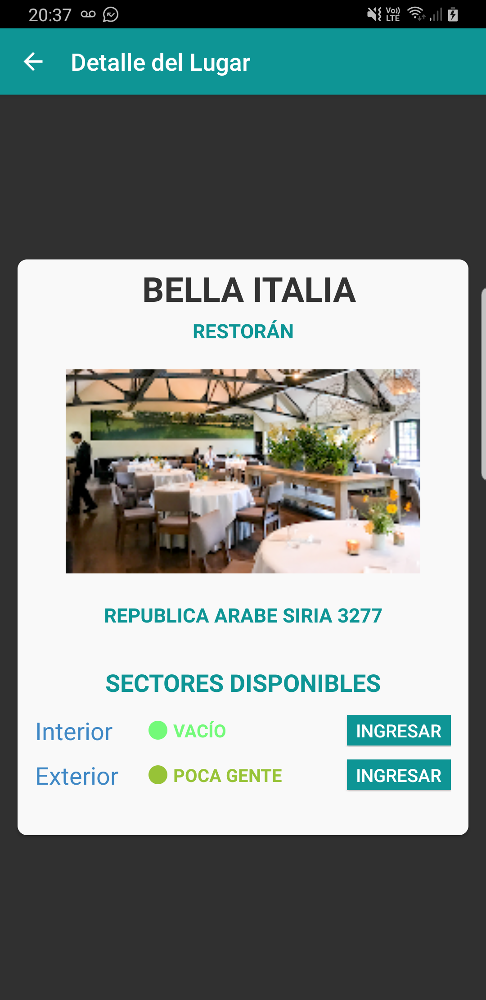
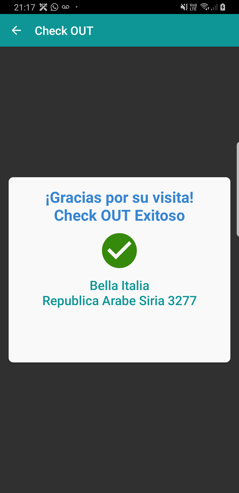
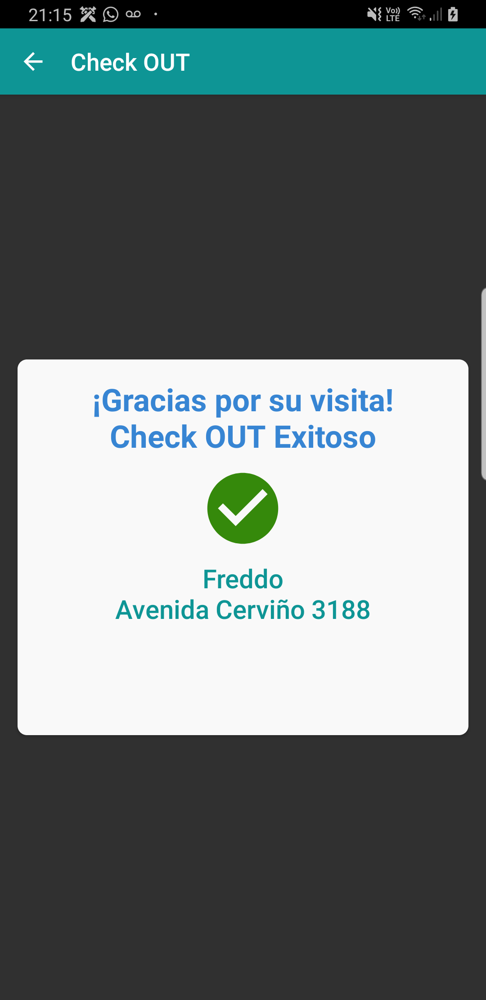

# Flujo de Pantallas de SafeOut

## App Icon + Splash + Login

## Menú de Navegación
Si el dispositivo no es compatible con NFC, no se visualizará la opción en el menú.

## Home 
Si el usuario ha realizado un Check-in, la Home disponibilizará la opción de Check-out.

## Mapa de lugares 
En el mapa se visualizarán los lugares disponibles en un radio de ubicación, con un color indicador de la ocupación actual (verde, amarillo, rojo).\
Al seleccionar uno de ellos, se mostrará una previa con información del lugar.

## Detalle de lugar
Al ver el detalle de un lugar, se disponibilizará la opción de "Reservar" sólo en aquellas secciones que admitan reservas.

## Buscar lugares
Se podrá ingresar un término de búsqueda, el cuál filtrará lugares por categoría, dirección o nombre.

## Check IN
### QR

### NFC

## Check OUT
### QR

mv 

### NFC

## Errores Checkin / Checkout

## Ver info
### QR

## Reservas

## Solicitud de permisos

