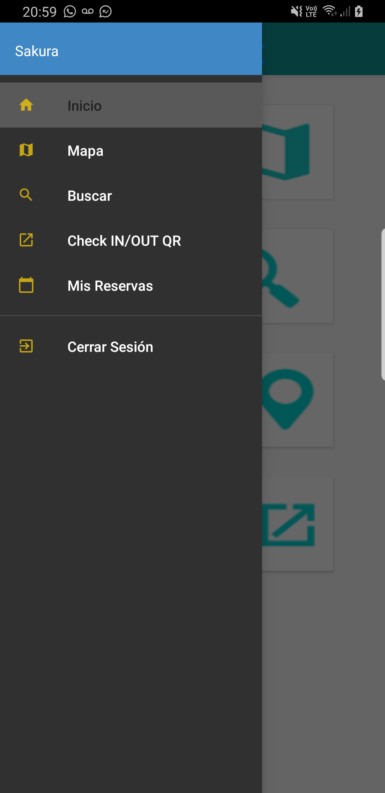
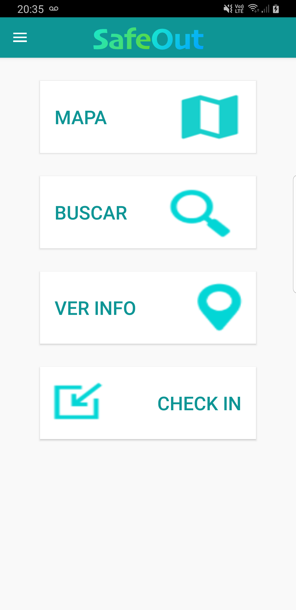
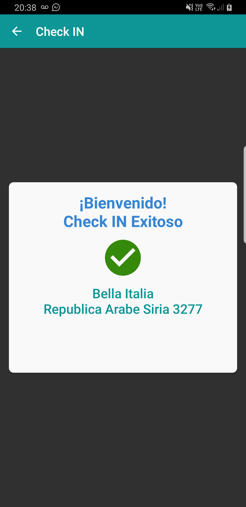
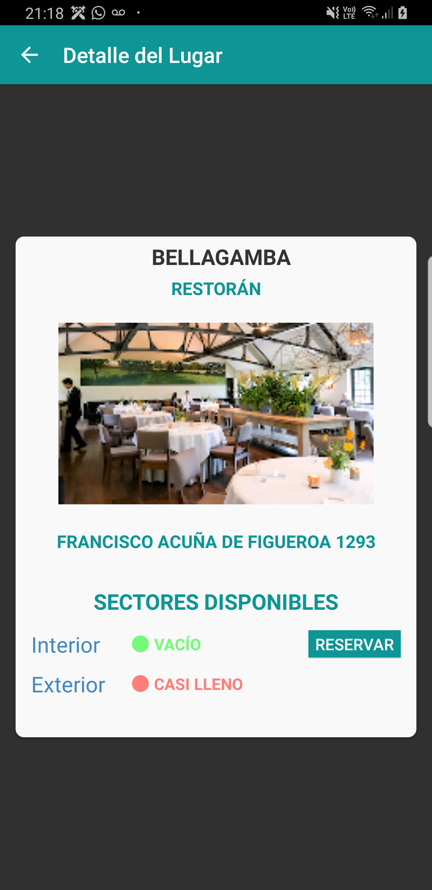

# Flujo de Pantallas de SafeOut

## Login

## Menú de Navegación
Si el dispositivo no es compatible con NFC, no se visualizará la opción en el menú.

## Home 
Si el usuario ha realizado un Check-in, la Home disponibilizará la opción de Check-out.

## Mapa de lugares 
En el mapa se visualizarán los lugares disponibles en un radio de ubicación, con un color indicador de la ocupación actual (verde, amarillo, rojo).\
Al seleccionar uno de ellos, se mostrará una previa con información del lugar.

## Detalle de lugar

## Buscar lugares

## Check IN
### QR

### NFC

## Check OUT
### QR

### NFC

## Errores Checkin / Checkout

## Ver info
### QR

## Reservas

